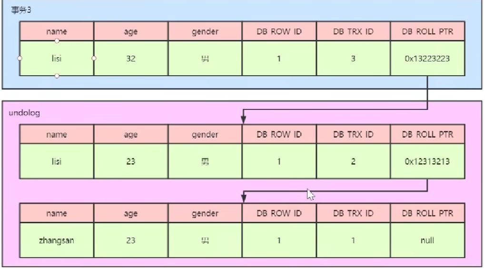

# Concurrency Control

## Timestamp Ordering

### timestamp allocate

1. System Clock：系统时间，缺点是夏令时的时候会回调一个小时，不是单调递增。
2. Logical Counter：用一个寄存器或者什么维护一个整数，单调递增。缺点是这个整数有上限，比如32位。
3. Hybrid：混合。

### 基本操作（Basic Timestamp）

1. 给每个值X都记录两个timestamp，一个是最后读该值的txn的timestamp（R-TS)，一个是最后写该值的timestamp（W-TS）。**在事务开始的时候**。
2. 读操作：读的事务的TS（Ti）<W-TS(X)，abort Ti 然后重启创建一个新的TS（就有更大的TS)。否则，允许事务TS读，并更新R-TS（x），**并且要创建一个本地的copy of X来确保Ti能够重复读到现在这个X**。
3. 写操作：如果TS(Ti) < W-TS(x) 或 Ts(Ti) < R-TS(X)，则abort Ti然后restart Ti（分配更大的timestamp）。否则，允许写，如果要可重复读，就也要创建本地X副本。
4. **写操作优化**：如果Ts(Ti) < R-TS(X)，abort并restart。**如果TS(Ti) < W-TS(x)，则跳过这个写操作继续执行下面的操作**。（因为对于外部来说，这个写操作总是要被覆盖的。
5. 特点：
   1. schedule是conflict serializable的。没有死锁。
   2. 对于长的事务，可能会导致starvation。就是一两个新的短的事务修改了数据，导致长事务被abort然后restart。
   3. 不是recoverable的。（一个事务在所有修改它读的数据提交后再提交，否则就不能保证重启之后还能读到相同的值）。
   4. 对于3，**其实就是会读到脏数据**（即没有commit的数据）。

### 乐观并发控制（Optimistic Concurrency Control）

 DBMS给每个事务都分配了一个单独的workspace，

将每个操作涉及的tuples都放到workspace中。读会把tuple复制到workspace中，写只是applied to workspace。Commit后，进行检查，再整体应用到global database中。

**每个tuple只有W-TS，没有R-TS**。

总共有三个阶段。

#### Work Phase

所有操作都在这个阶段执行。保存read set和write set，用在下一阶段。

#### Validation Phase

验证是否有冲突，能否提交到global database。**在这个阶段分配timestamp**。没分配前的timestamp都是无限大。

向前验证：检查所有并发执行的并且已经commit的txn（timestamp比自己小），看read/writeset是否有冲突（比如前一个修改了一个值，但是自己读到的还是旧的），如果有，就abort自己然后restart。

向后验证：检查所有并发执行的并且还没commit的txn（timestamp比自己大），看read/write是否有冲突，如果有就abort**自己这个txn**。

#### Write Phase

写入global database。

#### 适用的场景和优缺点

1. 相比于basic timestamp，前者是每进行一个操作就要检查这个操作的可行性，这个是到最后再来验证。
2. 在大量读请求的情况下，或者事务之间的数据操作交集不多的情况下（数据量很大而事务不多时，这个概率很大），就很适合用这种方法，不用请求锁。（**只是不用请求数据库的lock，底层的数据结构的操作还是要latch，不是同一个层面**）
3. 问题：
   1. 要复制到自己的workspace，消耗很大。
   2. validation和write阶段不能并行，是bottleneck。
   3. 但是在冲突很多的情况下，会导致事务做了大量的工作但是最后还被abort了。消耗比2PL大。
   4. 在validation阶段，多个事务同时查看一个事务本地保存的数据（read/Write set），还是要竞争这个数据结构的latch，因为这个事务可能还在执行，这个set可能会变。

## 幻像读（Phantom Problem）

发生在对一个范围tuple进行查询，tuple锁就无法控制了。解决方法有下面三种：

1. re-execute scan：在commit的时候，重新执行一遍看结果是不是这样
2. predicate lock：select的时候上共享锁，update，insert，delete的时候上排他锁。就是对一个条件上锁，锁住所有相关的tuple，负担很大，很少用。
3. **index locking：如果涉及的属性有索引，就直接在索引上加锁，这样跟该属性相关的tuple的增加或删除都会要获取这个索引的锁。如果还没有对应的值，就在索引的间隙上加锁，即间隙锁。如果不涉及任何index，就要保证任何已有的tuple不能改变成符合条件的tuple，任何符合条件的tuple不能被增加或者删除。**

## MVCC（Multi-Version Concurrency Control）

InnoDB中MVCC的实现原理，参考[MVCC实现原理是什么](https://www.bilibili.com/video/BV1864y1976i/?share_source=copy_web&vd_source=f120d4d54b426372a2c10ab0b8eea38d)

MVCC与spanner中的snapshot isolation类似。

### 使用的结构

1. 每个tuple后有三个隐藏字段：

   1. ROW_ID：隐藏的主键，自动生成的。
   2. TRX_ID：创建或者最后一次修改这个tuple的ID。
   3. ROLL_PTR：回滚指针，指向tuple的上一个版本，位于undo_log中。
2. undo log：回滚日志，记录着旧版本的数据，方便回滚。当进行insert时，产生的undo log只在事务回滚的时候需要，所以在事务提交后可以立刻被丢弃。但是当进行update或者delete时，事务回滚和read view中都需要这个旧版本记录，所以不能立刻丢弃。只有在快照读和事务回滚用不到的时候，会有一个专门的purge线程来清楚这个旧版本记录。

   
3. read view：

   1. 有三个全局属性：
      1. trx_list：一个数值列表，维护生成read view时活跃的事务id列表。
      2. up_limit_id：最小的当前活跃事务id。
      3. low_limit_id：下一个要分配的事务id号，即当前系统已经分配的最大事务id+1（最大事务包括活跃的，提交的，abort的）
   2. 在事务进行快照读操作时候产生的读视图。在事务执行快照读的那一刻，生成一个数据系统当前的快照，记录并维护系统当前活跃的事务id。
   3. 用来做可见性判断。就是当事务执行快照读的时候，根据read view的几个值，来判断能读到某个值的哪个版本。

### 具体操作

read view的具体比较规则：

1. 遍历每个tuple的各个版本（利用ROLL_PTR遍历，从新到旧），利用各个版本中的TRX_ID判断三次，都失败则进入下一个版本
2. 如果DB_TRX_ID<up_limit_id，说明这个版本在生成快照的时候已经提交了，可以读，否则进行下一步。
3. 如果DB_TRX_ID>=low_limit_id，说明这个版本在生成快照的时候还不存在，不能读，进入下一个版本，否则进行下一步。
4. 如果DB_TRX_ID在当前活跃列表里面，说明还没提交，不能读，进入下一个版本，否则可以读。

### 不同隔离级别的实现

变量都在read view那三个全局属性，所以要实现RC或者RR就利用生成read view的时机不同来实现。

1. 实现RC：每次快照读的时候都生成当前的read view，就会更新那三个全局属性，就能每次快照读都读到当前提交的事务的数据。
2. 实现RR：第一次快照读生成了read_view后，之后的每次快照读都用第一次的那个read view，使得每次快照读能读到的数据都和第一次快照读时一样。

### 能解决的问题

有读读，读写，写写问题，MVCC解决读写问题，但是不能解决写写问题。

读写问题包括：脏读取，不可重复读，幻像读(只解决了快照读的幻像读问题)。

写写问题，比如丢失更新，没法解决。

参考：[MVCC能否解决幻读 - xuwc - 博客园 (cnblogs.com)](https://www.cnblogs.com/xuwc/p/13873293.html)

[mysql间隙锁，next-key lock,row锁加锁范围分析_mysql 间隙锁 范围_forwardMyLife的博客-CSDN博客](https://blog.csdn.net/lucky_ly/article/details/125252075)
